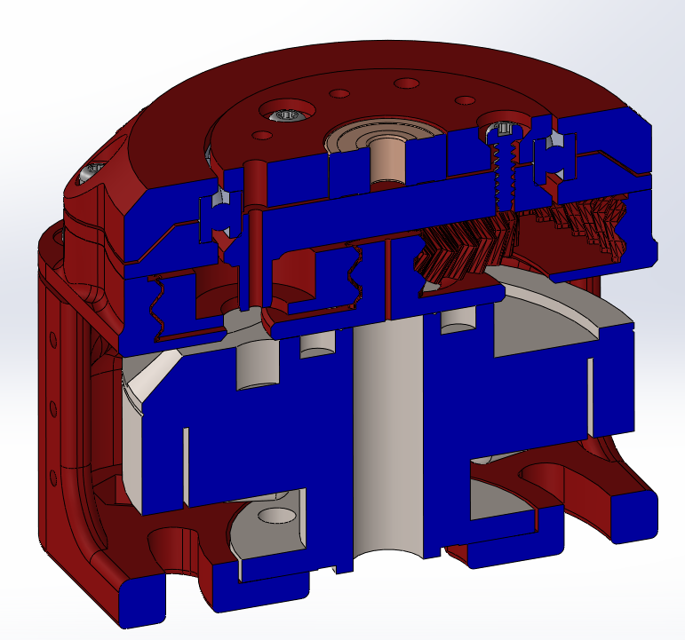
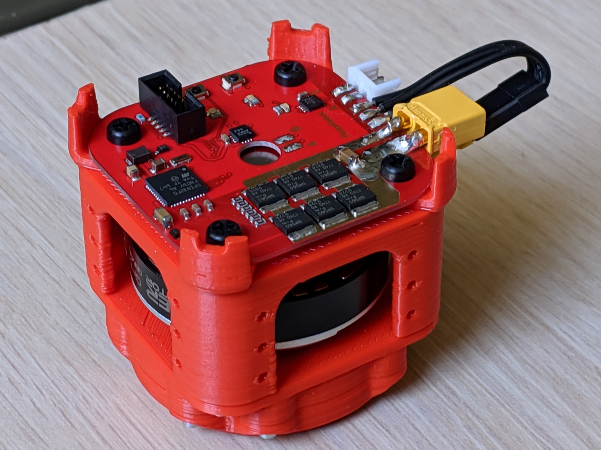
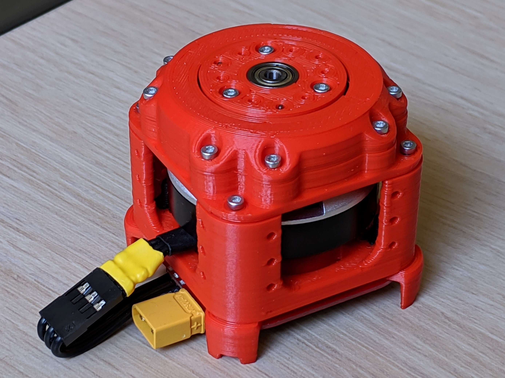

# TipTapMotor

## Print one of each STL, except for:
* "GearBoxAssy-Planet.STL", which needs a total of three.
* "SingleMotorPCBspacer.STL", which is optional, but needs a total of two.
Note: I used the LulzbotMini_TipTap.curaprofile on my lulzbot mini to get the tight tolerances needed on the gears and good first layer resolution.

## Purchased Parts:
* Qty 1. DirectServo pcb: https://github.com/DarrenLevine/DirectServo/tree/master/Manufacturing
* Qty 3. 18-8 Stainless Steel Dowel Pin, 1mm Diameter, 12mm Length
* Qty 15. 96817A156 Thread Forming Screw for Thin Plastic
* Qty 1. iPower GBM3506H-130T Gimbal Brushless Motor
* Qty 4. M3x10mm Nylon bolt and nut
* Qty 1. 6705 Thin Section Metric Ball Bearing Open 25x32x4
* Qty 3. 623ZZ 3mm x 10mm x 4mm Shielded Deep Groove Precision Ball Bearings
* Qty 3. Flat Head Screws M3 x 0.5 mm Thread, 6 mm Long (91420A116)
* Qty 1. Small diametric encoder magnet such as: https://www.kjmagnetics.com/proddetail.asp?prod=d82dia

## Assembly according to cross section:

Note: Not show in cross section - the three 1mm dowel pins must be hammered into the three holes of the "GearboxFace-LowerInner.STL", to provide shear support.

## Final product:

